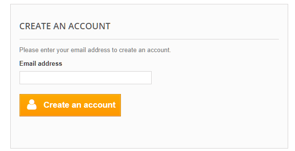
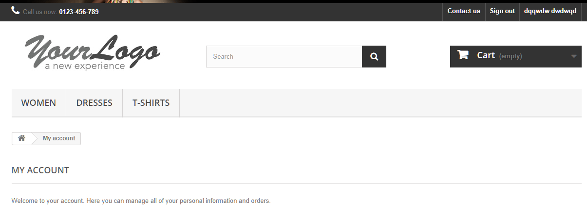
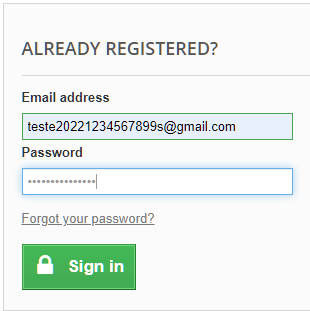
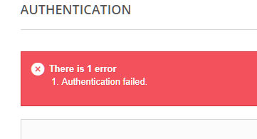

<h1 align="center"> Automation Practice </h1>
My Store - www.automationpractice.com

Instalação de Softwares necessarios:
1. IntelliJ
2. Java: JRE e JDK
3. Maven

Configurar as variaveis de ambiente:
1. JAVA_HOME 
2. Apache Maven 

Dependencias usadas no Maven:
1. selenium-java
2. junit
3. Webdriver Manager
4. Javafaker

-CASO DE TESTE:

Cadastrar usuario valido
   1. Acessar o site: www.automationpractice.com.
   2. Clicar no botão "SignIn".
   3. Inserir o endereço de email valido(ainda não cadastrado no site) em "CREATE AN ACCOUNT"

   4. Clicar no botão "Create an account".
   5. Preencher todos os campos obrigatorios.
   6. Clicar no botão "Register".
   7. Deverá ser exibido a pagina "My Account" com usuario logado.

Cadastrar usuario com conta em uso
   1. Acessar o site: www.automationpractice.com.
   2. Clicar no botão SignIn.
   3. Inserir o endereço de email valido(já cadastrado no site) em "CREATE AN ACCOUNT"
   4. Clicar no botão "Create an account" (deverá mostrar uma mensagem informando que o email já está em uso)

Fazer login com usuario valido
   1. Acessar o site: www.automationpractice.com.
   2. Clicar no botão SignIn.
   3. Inserir o endereço de email valido e senha(já cadastrado no site)
   4. Clicar no botão "Sign in"

   5. Deverá ser exibido a pagina "My Account" com usuario logado.

Fazer login com usuario não criado
   1. Acessar o site: www.automationpractice.com.
   2. Clicar no botão SignIn.
   3. Inserir o endereço de email valido (não cadastrado no site) e senha.
   4.Clicar no botão "Sign in"

Fazer login com usuario valido e senha incorreta
   1. Acessar o site: www.automationpractice.com.
   2. Clicar no botão SignIn.
   3. Inserir o endereço de email valido (já cadastrado no site)
   4. Inserir a senha incorreta.
   5. Clicar no botão "Sign in"
   